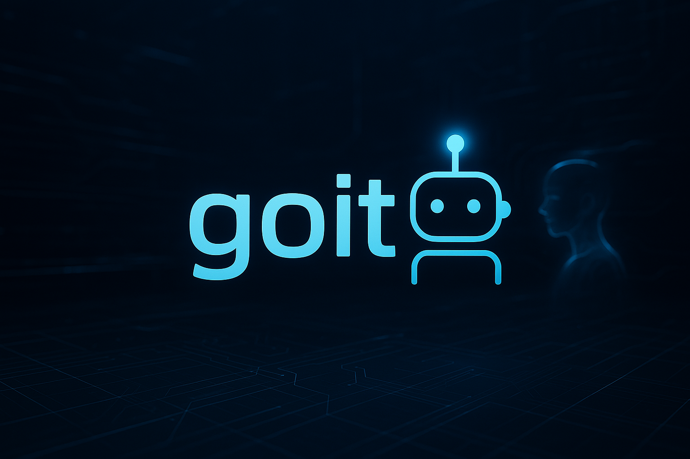

# goit - Git Commit Assistant with AI 💡

<div align="center">
  
</div>

## Project Description

goit is a powerful Go-based CLI tool designed to streamline Git operations and enhance commit message creation through AI assistance. It automates common Git workflows including file staging, committing, and pushing, while providing intelligent commit message suggestions based on staged changes. This tool is particularly valuable for developers who are new to Git or non-native English speakers, helping them create meaningful and natural commit messages.

## Features

- 🤖 AI-powered commit message generation
- ⚡ Automated Git workflow
- 🎯 Smart staging suggestions
- 🛠️ Written in Go for high performance

## Getting Started

Follow these steps to set up and run the project locally.

## Prerequisites

- Go 1.20 or higher
- Git
- Ollama for local AI model support

### Installation

```bash
# Install Go
brew install go

# Install Git
brew install git

# Install Ollama
brew install ollama
ollama pull llama3.2
```

### Building from Source

1. Clone the repository:
```bash
git clone https://github.com/yourusername/goit.git
cd goit
```

2. Build the binary:
```bash
go build -o goit
```

## Usage

### Basic Commands

```bash
# Only thin command, you can git add, commit, push!!
goit --ai
```

### AI Model Configuration

- Local: Uses Ollama with Mistral model (default)


## Contributing

We welcome contributions! Please feel free to submit a Pull Request.

### Development Setup

1. Fork the repository
2. Create your feature branch (`git checkout -b feature/amazing-feature`)
3. Commit your changes (`git commit -m 'Add some amazing feature'`)
4. Push to the branch (`git push origin feature/amazing-feature`)
5. Open a Pull Request

### Code Style

- Follow Go standard formatting (`go fmt`)
- Write tests for new features
- Update documentation as needed

## License

This project is licensed under the MIT License - see the [LICENSE](LICENSE) file for details.

```
MIT License

Copyright (c) 2024 goit

Permission is hereby granted, free of charge, to any person obtaining a copy
of this software and associated documentation files (the "Software"), to deal
in the Software without restriction, including without limitation the rights
to use, copy, modify, merge, publish, distribute, sublicense, and/or sell
copies of the Software, and to permit persons to whom the Software is
furnished to do so, subject to the following conditions:

The above copyright notice and this permission notice shall be included in all
copies or substantial portions of the Software.

THE SOFTWARE IS PROVIDED "AS IS", WITHOUT WARRANTY OF ANY KIND, EXPRESS OR
IMPLIED, INCLUDING BUT NOT LIMITED TO THE WARRANTIES OF MERCHANTABILITY,
FITNESS FOR A PARTICULAR PURPOSE AND NONINFRINGEMENT. IN NO EVENT SHALL THE
AUTHORS OR COPYRIGHT HOLDERS BE LIABLE FOR ANY CLAIM, DAMAGES OR OTHER
LIABILITY, WHETHER IN AN ACTION OF CONTRACT, TORT OR OTHERWISE, ARISING FROM,
OUT OF OR IN CONNECTION WITH THE SOFTWARE OR THE USE OR OTHER DEALINGS IN THE
SOFTWARE.
```

## Acknowledgments

- Thanks to all contributors who have helped shape this project
- Special thanks to the open-source community for their invaluable tools and libraries

## Contact

- GitHub Issues: [Create an issue](https://github.com/IwatsukaYura/goit/issues)
- Email: [iwatsukayura@gmail.com]
- Twitter: [@EnglishUra48278]

For bug reports and feature requests, please use the GitHub Issues page.

